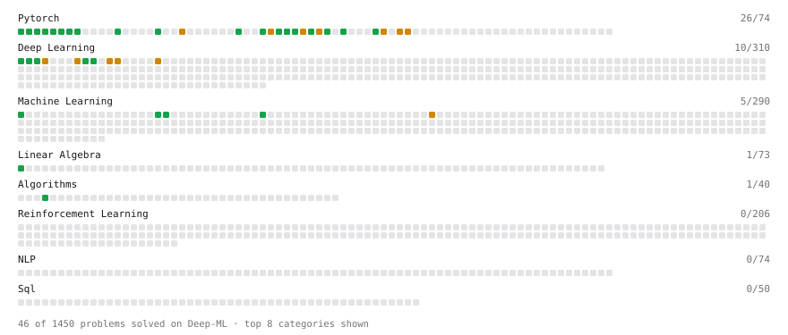

# Deep-ML

My machine learning practice from [Deep-ML](https://www.deep-ml.com). Every solution here was written by hand.

**39** solved · 38 problems · 0 labs · 1 math

[**Browse the interactive portfolio**](https://immortalzal.github.io/deep-ml/) to replay this filling in over time.

## Problems

| | Difficulty | Solved | |
| --- | --- | --- | --- |
| [Add a Bias Vector to a Batch via Broadcasting](https://www.deep-ml.com/problems/882) | easy | 2026-09-25 | [solution](problems/0882-add-a-bias-vector-to-a-batch-via-broadcasting) |
| [Build a Linear Regression Model with nn.Module](https://www.deep-ml.com/problems/885) | easy | 2026-09-25 | [solution](problems/0885-build-a-linear-regression-model-with-nn-module) |
| [Build an MLP with nn.Sequential](https://www.deep-ml.com/problems/887) | easy | 2026-09-24 | [solution](problems/0887-build-an-mlp-with-nn-sequential) |
| [Compute a Gradient with PyTorch Autograd](https://www.deep-ml.com/problems/884) | easy | 2026-09-24 | [solution](problems/0884-compute-a-gradient-with-pytorch-autograd) |
| [Create a Float Tensor from a Python List](https://www.deep-ml.com/problems/880) | easy | 2026-09-24 | [solution](problems/0880-create-a-float-tensor-from-a-python-list) |
| [Derivative of a Polynomial](https://www.deep-ml.com/problems/116) | easy | 2026-06-02 | [solution](problems/0116-derivative-of-a-polynomial) |
| [Detect Overfitting or Underfitting](https://www.deep-ml.com/problems/86) | easy | 2026-06-02 | [solution](problems/0086-detect-overfitting-or-underfitting) |
| [Gradient of a Square with Autograd](https://www.deep-ml.com/problems/1222) | easy | 2026-09-24 | [solution](problems/1222-gradient-of-a-square-with-autograd) |
| [Hamming Distance for Kanerva Coding](https://www.deep-ml.com/problems/647) | easy | 2026-06-02 | [solution](problems/0647-hamming-distance-for-kanerva-coding) |
| [Implement a Linear Layer Forward Pass with Matrix Multiplication](https://www.deep-ml.com/problems/883) | easy | 2026-09-25 | [solution](problems/0883-implement-a-linear-layer-forward-pass-with-matrix-multiplication) |
| [Implement Dropout from Scratch](https://www.deep-ml.com/problems/901) | easy | 2026-09-25 | [solution](problems/0901-implement-dropout-from-scratch) |
| [Implement Precision Metric](https://www.deep-ml.com/problems/46) | easy | 2026-06-05 | [solution](problems/0046-implement-precision-metric) |
| [Implement ReLU Activation Function](https://www.deep-ml.com/problems/42) | easy | 2026-06-11 | [solution](problems/0042-implement-relu-activation-function) |
| [Implement Weight Decay as L2 Regularization](https://www.deep-ml.com/problems/198) | easy | 2026-09-24 | [solution](problems/0198-implement-weight-decay-as-l2-regularization) |
| [Leaky ReLU Activation Function](https://www.deep-ml.com/problems/44) | easy | 2026-09-22 | [solution](problems/0044-leaky-relu-activation-function) |
| [Linear Kernel Function](https://www.deep-ml.com/problems/45) | easy | 2026-06-02 | [solution](problems/0045-linear-kernel-function) |
| [Linear Regression Using Normal Equation](https://www.deep-ml.com/problems/14) | easy | 2026-06-02 | [solution](problems/0014-linear-regression-using-normal-equation) |
| [Matrix-Vector Dot Product](https://www.deep-ml.com/problems/1) | easy | 2026-06-02 | [solution](problems/0001-matrix-vector-dot-product) |
| [Reshape and Transpose a Tensor](https://www.deep-ml.com/problems/881) | easy | 2026-09-24 | [solution](problems/0881-reshape-and-transpose-a-tensor) |
| [Run One Training Step: Forward, Loss, Backward, Optimizer](https://www.deep-ml.com/problems/886) | easy | 2026-09-24 | [solution](problems/0886-run-one-training-step-forward-loss-backward-optimizer) |
| [Sigmoid Activation Function Understanding](https://www.deep-ml.com/problems/22) | easy | 2026-06-11 | [solution](problems/0022-sigmoid-activation-function-understanding) |
| [Single Linear Neuron Forward](https://www.deep-ml.com/problems/1224) | easy | 2026-09-24 | [solution](problems/1224-single-linear-neuron-forward) |
| [Single Neuron](https://www.deep-ml.com/problems/24) | easy | 2026-06-11 | [solution](problems/0024-single-neuron) |
| [Sinusoidal Positional Encoding](https://www.deep-ml.com/problems/906) | easy | 2026-09-25 | [solution](problems/0906-sinusoidal-positional-encoding) |
| [Softmax Activation Function Implementation ](https://www.deep-ml.com/problems/23) | easy | 2026-06-11 | [solution](problems/0023-softmax-activation-function-implementation) |
| [Adam Optimizer](https://www.deep-ml.com/problems/87) | medium | 2026-09-24 | [solution](problems/0087-adam-optimizer) |
| [Gradient Clipping by Norm](https://www.deep-ml.com/problems/909) | medium | 2026-09-25 | [solution](problems/0909-gradient-clipping-by-norm) |
| [Gradient of a Weighted Sum of Squares](https://www.deep-ml.com/problems/1223) | medium | 2026-09-25 | [solution](problems/1223-gradient-of-a-weighted-sum-of-squares) |
| [Implement K-Nearest Neighbors](https://www.deep-ml.com/problems/173) | medium | 2026-09-24 | [solution](problems/0173-implement-k-nearest-neighbors) |
| [Implement Self-Attention Mechanism](https://www.deep-ml.com/problems/53) | medium | 2026-09-22 | [solution](problems/0053-implement-self-attention-mechanism) |
| [Implementing a Simple RNN](https://www.deep-ml.com/problems/54) | medium | 2026-09-23 | [solution](problems/0054-implementing-a-simple-rnn) |
| [Merge Multiple DataFrames](https://www.deep-ml.com/problems/1129) | medium | 2026-09-24 | [solution](problems/1129-merge-multiple-dataframes) |
| [One Adam Update Step](https://www.deep-ml.com/problems/1236) | medium | 2026-09-25 | [solution](problems/1236-one-adam-update-step) |
| [One Training Step](https://www.deep-ml.com/problems/1219) | medium | 2026-09-25 | [solution](problems/1219-one-training-step) |
| [SGD with Momentum Step](https://www.deep-ml.com/problems/1235) | medium | 2026-09-25 | [solution](problems/1235-sgd-with-momentum-step) |
| [Simple Convolutional 2D Layer](https://www.deep-ml.com/problems/41) | medium | 2026-09-23 | [solution](problems/0041-simple-convolutional-2d-layer) |
| [Single Neuron with Backpropagation](https://www.deep-ml.com/problems/25) | medium | 2026-06-11 | [solution](problems/0025-single-neuron-with-backpropagation) |
| [Two-Layer MLP Forward Pass](https://www.deep-ml.com/problems/1225) | medium | 2026-09-25 | [solution](problems/1225-two-layer-mlp-forward-pass) |

## Math

| | Difficulty | Solved | |
| --- | --- | --- | --- |
| [Derivatives and Gradients](https://www.deep-ml.com/math-problems/1) | easy | 2026-09-24 | [solution](math/0001-derivatives-and-gradients) |

---

_This file is regenerated by Deep-ML on every push._
